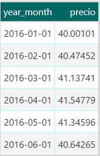
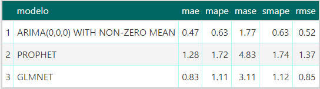

```{r setup, include=FALSE}
knitr::opts_chunk$set(echo = FALSE)
library(readr)
library(here)
library(tidyverse)
library(sf)
library(leaflet)
library(terra)
library(RColorBrewer)
library(xgboost)
library(caret)
library(tidymodels)
library(modeltime)
library(timetk)
library(shiny)
library(gt)
```
```{r cargar datos,include=F}
establecimientos <- read_delim("datos/establecimiento.csv", delim = ";", locale = locale(encoding = "latin1")) %>%
  select(id.establecimientos, nombre.sucursal, ccz, cadena, long, lat, depto, id.depto) %>%
  mutate(lat=as.numeric(sub(',','.',lat,fixed=T)),
         long=as.numeric(sub(',','.',long,fixed=T)),
         # arreglamos Ta Ta que le faltaba el signo
         long = ifelse(long > 0, -34.88675, long),
         # arreglamos San Roque del aeropuerto, que estaba mal
         long = ifelse(id.establecimientos == 679, -34.83675, long),
         lat = ifelse(id.establecimientos == 679, -56.01600, lat)) %>%
  filter_at(c("long", "lat"), function(x) !is.na(x)) |> mutate(lng=lat,lat=long) |> select(-long)

precios <- readRDS(here("precios_canasta.RDS"))

df_depto <- st_as_sf(vect(here("Mapas","ine_depto.shp"))) %>% st_set_crs(5382) %>%  st_transform(4326)

df_mvdeo <- st_as_sf(vect(here("Mapas","ine_ccz_mvd.shp")))
```

## Objetivo

- Analizar diferencias de precios a lo largo del tiempo, en distintos lugares dentro del país y dentro de Montevideo.

\vspace{12pt}

- Proveer una guía que ayude a identificar dónde conviene hacer las compras de entre los establecimientos de Montevideo que forman parte de la encuesta del índice de precios al consumidor.

\vspace{12pt}

 - Utilizar modelos basados en series temporales para predecir los precios de los productos en el futuro.

## Datos 

- Se cuenta con datos a partir del año 2016 y hasta marzo del 2023

\vspace{8pt}

- Hay un total de 766 establecimientos. 

\vspace{8pt}

- Hay 363 productos, pero solo usamos los 18 de la canasta básica y 2 más.

\vspace{8pt}

\pause

Como no se encontraron ponderadores para analizar la canasta básica en su conjunto mostraremos el análisis obtenido a partir de los precios de los fideos. 


***


***

```{r,eval=F,echo=T}
precios_canasta <- DBI::dbGetQuery(
  con,
  "
  SELECT
    fact_price.id_producto,
    id_establecimientos,
    AVG(precio),
    EXTRACT(year from fecha) * 100 + EXTRACT(month from fecha)
    as year_month
  FROM
    scraping_precios.fact_price
  LEFT JOIN
    d_productos ON fact_price.id_producto = d_productos.id_producto
  WHERE
    fact_price.id_producto IN (1,2,3,13,14,15,16,17,18,19,
     20,21,23,22,24,25,29,30,40,41,48,49,50,52,53,54,61,62, 76,
     77,78,85,86,87,102,103,104,121,122,123,124,130,131,132,
     133,134,135,140,141,142,149,150,151,359,361,365,26,27,28,
     55,56,57) 
  GROUP BY fact_price.id_producto, id_establecimientos,
  EXTRACT(year from fecha) * 100 + EXTRACT(month from fecha)
  "
)
```


## Establecimientos

```{r mapa_establecimientos, fig.cap = "Mapa de los establecimientos disponibles. Se concentran principalmente en la capital y el sur del país", fig.height=3}
ggplot() + 
  geom_sf(data=df_depto,fill=NA,color="gray20") +
  geom_sf(data=precios %>% filter(!duplicated(geometry)), aes(geometry = geometry), pch=4,color="red") +
  theme_void() +
  theme(plot.title=element_text(hjust=1/2))
```

***

```{r, fig.cap = "Cantidad de establecimientos por departamento. Mas del 60% se encuentran en Montevideo"}

precios %>% 
  filter(!duplicated(id_establecimientos)) %>% 
  group_by(depto = trimws(depto)) %>% 
  summarise(n = n()) %>% 
  ggplot(aes(x = reorder(depto, -n), y = n)) +
  geom_bar(fill = "#baeb34", stat = "identity") +
  geom_text(aes(label = n, y = n + 10)) +
  labs(x = "departamento", y = "cantidad de establecimientos") +
  theme_bw() +
  theme(axis.text.x = element_text(angle = 35))
```

***

```{r, fig.cap = "Proporción de establecimientos que pertenecen a una cadena de supermercados. Más del 80% pertenecen a alguna de las cadenas"}

precios %>% 
  filter(!duplicated(id_establecimientos)) %>%
  mutate(cadena = ifelse(cadena == "Sin Cadena", "NO", "SI")) %>% 
  group_by(cadena) %>% 
  summarise(n = n()/nrow(.)) %>% 
  ggplot(aes(x = cadena, y = n, fill = cadena)) +
  geom_bar(stat = "identity") +
  scale_y_continuous("", labels = scales::percent) +
  scale_fill_discrete("El establecimiento pertenece a una cadena:", breaks = c("SI", "NO")) +
  coord_flip() +
  labs(x = " ", y = "") +
  theme_bw()
```

***

```{r, fig.cap = "Cadenas con la mayor cantidad de establecimientos. Los porcentajes son con respecto a la cantidad total de establecimientos"}

precios %>% 
  filter(!duplicated(id_establecimientos)) %>% 
  count(cadena) %>% 
  filter(cadena != "Sin Cadena" & n > 20) %>% 
  ggplot(aes(x = reorder(cadena, -n), y = n)) + 
  geom_bar(stat = "identity", fill = "#baeb34") +
  geom_text(aes(y = n + 5, label = paste(round(n/(nrow(precios %>% filter(!duplicated(id_establecimientos))))*100, 1), "%"))) +
  labs(x = "Cadena", y = "Cantidad de establecimientos") +
  theme_bw() +
  theme(axis.text.x = element_text(angle = 25))

```

## Productos

```{r, fig.cap="Precio de los fideos a lo largo del tiempo. Se observa una tendencia al aumento a través de los años",message=F}
precios %>% 
  filter(id_producto %in% 52:57 & avg > 0) %>% 
  group_by(id_producto, year_month,nombre) %>% 
  summarise(precio = mean(avg)) %>% 
  ggplot(aes(x = year_month, y = precio, color = as.factor(nombre))) +
  geom_line(linewidth = 1) +
  scale_color_discrete("Producto:") +
  xlab("fecha") +
  theme(legend.position = "bottom", legend.key.size = unit(1, "mm")) +
  guides(color=guide_legend(nrow=6,byrow=TRUE))
```

## A nivel departamental

```{r, mapa_precios, fig.cap = "Mapa de Uruguay según el precio promedio de los fideos en cada departamento para todo el período", fig.height=3}
fideos_dpto <- precios %>% 
  filter(id_producto %in% 52:57) %>% 
#  group_by(id.depto,id_producto) %>% 
#  summarise(precio = mean(avg)) %>% 
  group_by(id.depto) %>% 
  summarise(precio = mean(avg))

ggplot(data=df_depto %>% left_join(fideos_dpto, by = c("DEPTO" = "id.depto"))) + 
  geom_sf(aes(fill=precio),color="gray20") +
  scale_fill_gradientn(colours = brewer.pal(5, "OrRd")) +
  theme_void() +
  labs(title="") +
  theme(plot.title=element_text(hjust=1/2))


```


## En Montevideo

```{r, mapa_precios_mvd, fig.cap = "Mapa de Montevideo según el precio promedio de los fideos en cada CCZ para todo el período", fig.height=3}
cczjoin <- select(establecimientos,c(id.establecimientos,ccz))
fideos_mvd <- precios %>% 
  filter(id_producto %in% 52:57,depto=="Montevideo") %>% left_join(cczjoin,by=c("id_establecimientos"="id.establecimientos"),suffix=c("","")) |>  
#  group_by(ccz,id_producto) %>% 
#  summarise(precio = mean(avg)) %>% 
  group_by(ccz) %>% 
  summarise(precio = mean(avg))

ggplot(data=df_mvdeo %>% left_join(fideos_mvd, by = c("CCZ" = "ccz"))) + 
  geom_sf(aes(fill=precio),color="gray20") +
  scale_fill_gradientn(colours = brewer.pal(5, "OrRd")) +
  theme_void() +
  labs(title="") +
  theme(plot.title=element_text(hjust=1/2))


```


## Predicción de precios


:::::: {.cols data-latex=""}

::: {.col data-latex="{0.55\textwidth}"}



:::

::: {.col data-latex="{0.05\textwidth}"}
\ 
:::

::: {.col data-latex="{0.4\textwidth}"}

\textbf{Paquetes utilizados:}

\vspace{8pt}

- caret

\vspace{8pt}

- XGBoost

\vspace{8pt}

- forecast

\vspace{8pt}

- modeltime

\vspace{8pt}

- timetk

\vspace{8pt}

- tidymodels

:::
::::::


***


***


***


***




## ShinyApp

La aplicación permite ver un análisis del precio de un producto y marcas específicas a seleccionar.

Contiene 3 ventanas con 3 distintas visualizaciones:

  \begin{itemize}
    \pause
  
    \item{Mapa interactivo de Montevideo, con los precios por establecimiento}
    
    \pause
    
    \item{Mapa de los precios por departamento}
    
    \pause
    
    \item{Predicción del precio}
    
  \end{itemize}

\pause


link:
\url{https://my5poz-manuel0toledo.shinyapps.io/canasta_basica/}


