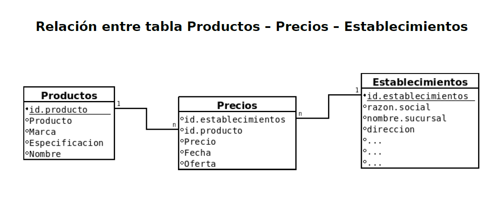
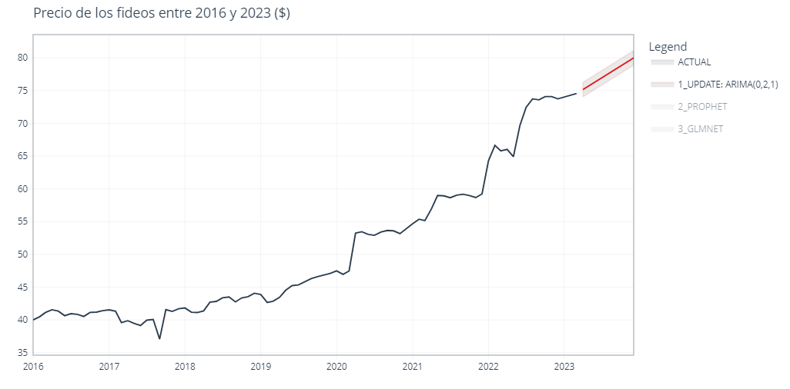
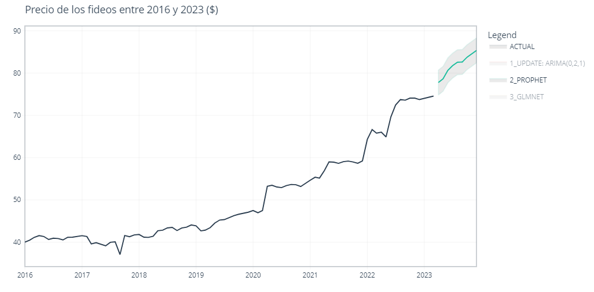
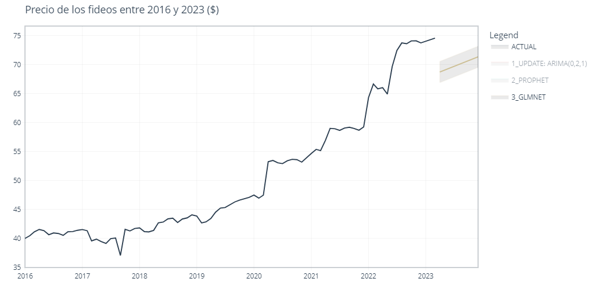
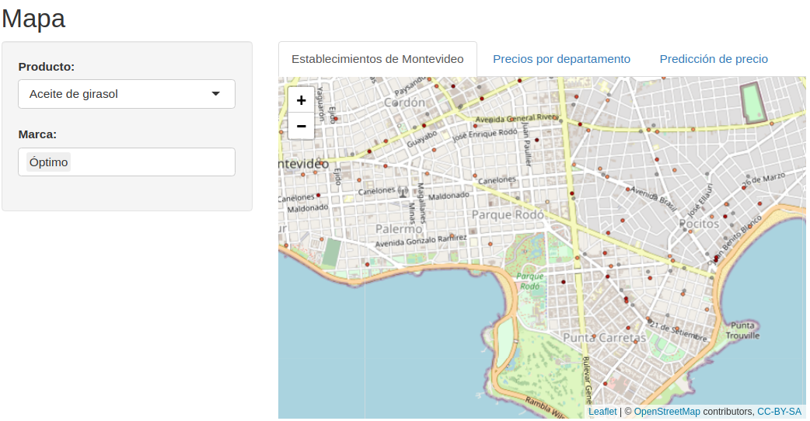
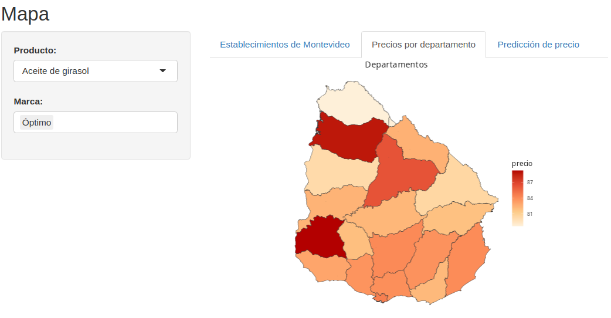
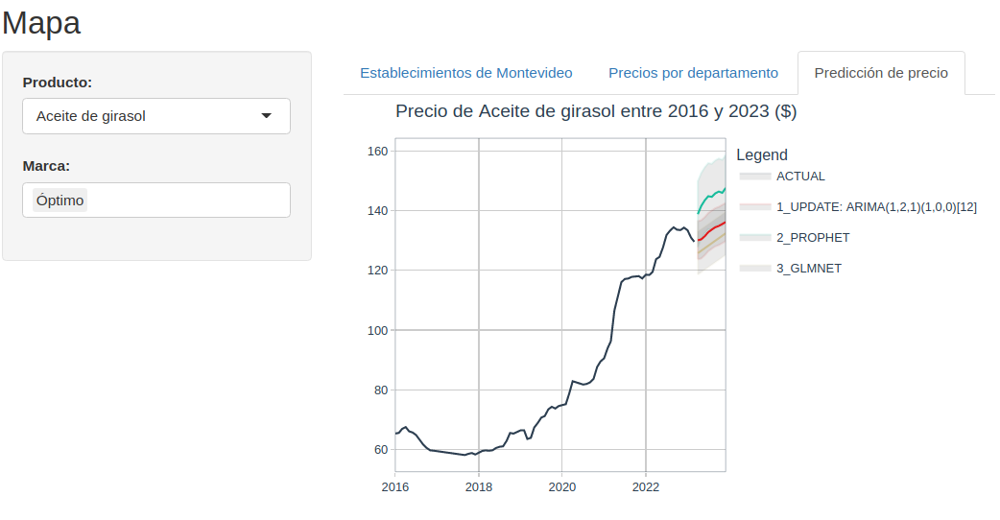

```{r setup, include=FALSE, message = FALSE}
knitr::opts_chunk$set(echo = FALSE, message = FALSE, warning = FALSE, fig.pos = "h!")
library(readr)
library(here)
library(tidyverse)
library(sf)
library(leaflet)
library(terra)
library(RColorBrewer)
library(xgboost)
library(caret)
library(tidymodels)
library(modeltime)
library(timetk)
library(shiny)
library(gt)
```

# Introducción

Este proyecto surge a partir de la información provista por el SIPC (Sistema de Información de Precios al Consumidor) del Ministerio de Economía y Finanzas. Dicho organismo brinda información acerca de los precios de una serie de productos a través del tiempo y para distintos establecimientos en todos los departamentos de Uruguay.

Por otro lado, a raíz de la amplia diversidad de los productos de los cuales se tienen datos, se decidió tomar solamente aquellos que son parte de la CBA (Canasta Básica de Alimentos) de Uruguay.

El objetivo del trabajo es generar un análisis y visualizaciones que permitan ver las variaciones en los precios de dichos productos a lo largo del tiempo, en distintos lugares dentro del país y en establecimientos dentro de Montevideo. Esto resultaría de utilidad para ayudar a los consumidores a tomar mejores decisiones financieras a la hora de comprar alimentos. 

Un objetivo adicional es el de utilizar modelos basados en series temporales para predecir los precios de los productos en el futuro.

El producto final que se busca proveer es una aplicación interactiva mediante el paquete *Shiny* [@shiny] que para cada uno de los productos presentes en la CBA, despliegue una serie de visualizaciones descriptivas de su precio, en función de los aspectos mencionados anteriormente.

A lo largo del informe se usarán los datos de los precios de los fideos como referencia para explicar los datos y visaulizaciones, dado que no se encontró una forma de ponderar los precios de la canasta básica. Sin embargo, la aplicación de Shiny permitirá seleccionar los productos de manera individual.

\newpage

# Datos

El SIPC presenta los datos en tres datasets:

- Establecimientos: es una lista de los establecimientos de los cuales se obtienen los precios. Se obtiene en la web de Catálogo abierto de datos.
- Productos: es una lista de los productos de los cuales se tienen los precios. Se obtiene en la web de Catálogo abierto de datos.
- Precios: contiene la información acerca de los precios registrados en cada momento del tiempo, para cada producto en cada establecimiento. Si bien se puede obtener en la web de Catálogo abierto de datos, debido a su tamaño se extrae con una consulta SQL.

A continuación se muestra una imágen de la estructura de la base:


Además de las variables presentes en la imagen, el dataset de Establecimientos tiene la dirección, centro comunal zonal, barrio, cantidad de cajas, cadena, longitud y latitud, ciudad, departamento y superficie.

Se cuenta con datos a partir del año 2016 y hasta marzo del 2023. Estos contienen 363 productos dentro 766 establecimientos. De esos, solamente se usarán los 18 productos dentro de la CBA más 2 productos que se agregaron por decisión personal (para cada producto existen varias marcas).  

Los productos son:

- Aceite de girasol 900 cc
- Aguja vacuna 1 kg (con y sin hueso)
- Arroz blanco 1 kg
- Arvejas en conserva 300 g
- Azúcar blanco 1 kg
- Carne picada vacuna 1 kg
- Cocoa 500 g
- Dulce de leche 1 kg
- Fideos secos al huevo 500 g
- Galletitas al agua 140 g
- Harina trigo común 0000  1 kg
- Huevos colorados 1/2 docena
- Manteca 200 g
- Pan flauta 215 g
- Papel higiénico hoja simple 4 rollos 30 mts
- Pollo entero fresco con menudos 1 kg
- Pulpa de tomate 1 L
- Sal fina yodada fluorada 500 g
- Yerba mate común 1 kg
- Café (agregado)
- Fideos secos de sémola 500 g (agregado)

A partir de los datasets, se construyó uno con el precio promedio mensual para cada producto (desagregándolo según las marcas y establecimientos), que incluyera parte de la información presente en Establecimientos (el nombre de la sucursal, cadena, coordenadas, barrio y departamento) y Productos (nombre y marca). Tanto la agregación como pegado de los datos se hizo a través de la consulta SQL, utilizando la variable de fecha y las *keys* respectivas, id.establecimientos e id_productos.


```{r consulta SQL, eval = F}
usethis::edit_r_environ(
  scope = "project"
)

con <- DBI::dbConnect(
  RPostgres::Postgres(),
  host = Sys.getenv("DB_HOST"),
  port = Sys.getenv("DB_PORT"),
  user = Sys.getenv("DB_USER"),
  password = Sys.getenv("DB_PASS"),
  dbname = Sys.getenv("DB_NAME")
)


precios_canasta <- DBI::dbGetQuery(
  con,
  "
  SELECT
    fact_price.id_producto,
    id_establecimientos,
    AVG(precio),
    EXTRACT(year from fecha) * 100 + EXTRACT(month from fecha) as year_month
  FROM
    scraping_precios.fact_price
  LEFT JOIN
    d_productos ON fact_price.id_producto = d_productos.id_producto
  WHERE
    fact_price.id_producto IN (1,2,3,13,14,15,16,17,18,19,20,21,23,22,24,25,29,30,40,41,48,49,50,52,53,54,61,62,76,77,78,85,86,87,102,103,104,121,122,123,124,130,131,132,133,134,135,140,141,142,149,150,151,359,361,365,26,27,28,55,56,57) 
  GROUP BY fact_price.id_producto, id_establecimientos, EXTRACT(year from fecha) * 100 + EXTRACT(month from fecha)
  "
)
```

```{r preprocesamiento y datos auxiliares, eval = F}
establecimientos <- read_delim("datos/establecimiento.csv", delim = ";", locale = locale(encoding = "latin1")) %>% 
  select(id.establecimientos, nombre.sucursal, barrio, cadena, long, lat, depto, id.depto) %>% 
  mutate(lat=as.numeric(sub(',','.',lat,fixed=T)),
         long=as.numeric(sub(',','.',long,fixed=T)),
         # arreglamos Ta Ta que le faltaba el signo 
         long = ifelse(long > 0, -34.88675, long),
         # arreglamos San Roque del aeropuerto, que estaba mal
         long = ifelse(id.establecimientos == 679, -34.83675, long),
         lat = ifelse(id.establecimientos == 679, -56.01600, lat))

productos <- read_csv2("datos/productos.csv", locale = readr::locale(encoding = "latin1")) %>% 
  select(id.producto, producto, marca, nombre) 

precios_canasta <- left_join(precios_canasta, establecimientos, by = c("id_establecimientos" = "id.establecimientos")) %>% 
  left_join(productos, by = c("id_producto" = "id.producto")) %>% 
  filter_at(c("long", "lat"), function(x) !is.na(x))

precios_canasta <- st_as_sf(precios_canasta, coords = c("lat", "long")) %>% 
  st_set_crs(4326) %>% 
  as.data.frame()

saveRDS(precios_canasta, "precios_canasta.RDS")
```

```{r cargar datos}
establecimientos <- read_delim("datos/establecimiento.csv", delim = ";", locale = locale(encoding = "latin1")) %>% 
  select(id.establecimientos, nombre.sucursal, ccz, cadena, long, lat, depto, id.depto) %>% 
  mutate(lat=as.numeric(sub(',','.',lat,fixed=T)),
         long=as.numeric(sub(',','.',long,fixed=T)),
         # arreglamos Ta Ta que le faltaba el signo 
         long = ifelse(long > 0, -34.88675, long),
         # arreglamos San Roque del aeropuerto, que estaba mal
         long = ifelse(id.establecimientos == 679, -34.83675, long),
         lat = ifelse(id.establecimientos == 679, -56.01600, lat)) %>% 
  filter_at(c("long", "lat"), function(x) !is.na(x)) |> mutate(lng=lat,lat=long) |> select(-long)

precios <- readRDS(here("precios_canasta.RDS"))

df_depto <- st_as_sf(vect(here("Mapas","ine_depto.shp"))) %>% st_set_crs(5382) %>%  st_transform(4326)

df_mvdeo <- st_as_sf(vect(here("Mapas","ine_ccz_mvd.shp")))
```

\newpage

# Análisis exploratorio

Para comenzar con el análisis de los datos, se intentaron visualizar a nivel general las características de los productos y establecimientos disponibles.

Para los establecimientos, resulta interesante ver cómo se distribuyen en el territorio del país. Para eso se graficó un mapa donde cada uno es representado por una cruz (figura 1). Además, a través de un gráfico de barras se presenta la cantidad de establecimientos por departamento (figura 2).


```{r mapa_establecimientos, fig.cap = "Mapa de los establecimientos disponibles. Se concentran principalmente en la capital y el sur del país.", fig.height=3}
ggplot() + 
  geom_sf(data=df_depto,fill=NA,color="gray20") +
  geom_sf(data=precios %>% filter(!duplicated(geometry)), aes(geometry = geometry), pch=4,color="red") +
  theme_void() +
  labs(title="Establecimientos") +
  theme(plot.title=element_text(hjust=1/2))
```

```{r fig.cap = "Cantidad de establecimientos por departamento. Mas del 60% se encuentran en Montevideo", fig.height=3}

precios %>% 
  filter(!duplicated(id_establecimientos)) %>% 
  group_by(depto = trimws(depto)) %>% 
  summarise(n = n()) %>% 
  ggplot(aes(x = reorder(depto, -n), y = n)) +
  geom_bar(fill = "#baeb34", stat = "identity") +
  geom_text(aes(label = n, y = n + 10)) +
  labs(x = "departamento", y = "cantidad de establecimientos") +
  theme_bw() +
  theme(axis.text.x = element_text(angle = 35))
```

Como es posible ver en ambos gráficos, los establecimientos encuestados se distribuyen principalmente sobre la costa y en la capital. Algunos departamentos casi no están representados, dada la baja cantidad de establecimientos relevados.

Siguiendo con los establecimientos, también interesa saber qué proporción pertenece a una cadena, y cuáles son las cadenas que tienen la mayor cantidad de establecimientos

```{r fig.cap = "Proporción de establecimientos que pertenecen a una cadena de supermercados. Más del 80% pertenecen a alguna de las cadenas", fig.height= 3}

precios %>% 
  filter(!duplicated(id_establecimientos)) %>%
  mutate(cadena = ifelse(cadena == "Sin Cadena", "NO", "SI")) %>% 
  group_by(cadena) %>% 
  summarise(n = n()/nrow(.)) %>% 
  ggplot(aes(x = cadena, y = n, fill = cadena)) +
  geom_bar(stat = "identity") +
  scale_y_continuous("", labels = scales::percent) +
  scale_fill_discrete("El establecimiento pertenece a una cadena:", breaks = c("SI", "NO")) +
  coord_flip() +
  labs(x = " ", y = "") +
  theme_bw()
```

Cómo se puede observar en la figura 3, la mayoría de los establecimientos forman parte de una cadena. A continuación se presentan las diez cadenas con la mayor cantidad de establecimientos (figura 4).

```{r fig.cap = "Cadenas con la mayor cantidad de establecimientos. Los porcentajes son con respecto a la cantidad total de establecimientos.", fig.height= 3}

precios %>% 
  filter(!duplicated(id_establecimientos)) %>% 
  count(cadena) %>% 
  filter(cadena != "Sin Cadena" & n > 20) %>% 
  ggplot(aes(x = reorder(cadena, -n), y = n)) + 
  geom_bar(stat = "identity", fill = "#baeb34") +
  geom_text(aes(y = n + 5, label = paste(round(n/(nrow(precios %>% filter(!duplicated(id_establecimientos))))*100, 1), "%"))) +
  labs(x = "Cadena", y = "Cantidad de establecimientos") +
  theme_bw() +
  theme(axis.text.x = element_text(angle = 25))

```

Este gráfico permite dar cuenta que más de la mitad de los establecimientos relevados corresponden solamente a cinco cadenas. Sumando las diez con mayor cantidad, ese porcentaje alcanza el 70%.

A continuación se presenta el análisis focalizado en los productos. Como se mencionó anteriormente, se tomaron los fideos como producto de referencia.

La figura 5 presenta una comparativa de los precios de fideos a lo largo del tiempo entre las distintas marcas y tipos (de sémola o al huevo). Se observó que todos los productos aumentan a un mismo ritmo con excepción de los fideos Puritas, que mantuvieron su precio durante años, lo cual resulta bastante extraño.

```{r, fig.cap="Precio de los fideos a lo largo del tiempo. Se observa una tendencia al aumento a través de los años", fig.height=4}
precios %>% 
  filter(id_producto %in% 52:57 & avg > 0) %>% 
  group_by(id_producto, year_month,nombre) %>% 
  summarise(precio = mean(avg)) %>% 
  ggplot(aes(x = year_month, y = precio, color = as.factor(nombre))) +
  geom_line(linewidth = 1) +
  scale_color_discrete("Producto:") +
  xlab("fecha") +
  theme(legend.position = "bottom", legend.key.size = unit(1, "mm")) +
  guides(color=guide_legend(nrow=6,byrow=TRUE))
```

Analizando los precios de los fideos por región (figura 6) se notó bastante homogeneidad a nivel departamental, con algunas excepciones que también se podrían explicar por el bajo tamaño de muestra o la ausencia de marcas baratas/caras en algunos departamentos.

Dentro de Montevideo (figura 7) se notaron más diferencias. Los barrios de mayor poder adquisitivo tienen los precios más elevados y las áreas rurales los precios más bajos.

```{r mapa_precios, fig.cap = "Mapa de Uruguay según el precio promedio de los fideos en cada departamento para todo el período.", fig.height=3}
fideos_dpto <- precios %>% 
  filter(id_producto %in% 52:57) %>% 
#  group_by(id.depto,id_producto) %>% 
#  summarise(precio = mean(avg)) %>% 
  group_by(id.depto) %>% 
  summarise(precio = mean(avg))

ggplot(data=df_depto %>% left_join(fideos_dpto, by = c("DEPTO" = "id.depto"))) + 
  geom_sf(aes(fill=precio),color="gray20") +
  scale_fill_gradientn(colours = brewer.pal(5, "OrRd")) +
  theme_void() +
  labs(title="") +
  theme(plot.title=element_text(hjust=1/2))


```

```{r mapa_precios_mvd, fig.cap = "Mapa de Montevideo según el precio promedio de los fideos en cada CCZ para todo el período.", fig.height=3}
cczjoin <- select(establecimientos,c(id.establecimientos,ccz))
fideos_mvd <- precios %>% 
  filter(id_producto %in% 52:57,depto=="Montevideo") %>% left_join(cczjoin,by=c("id_establecimientos"="id.establecimientos"),suffix=c("","")) |>  
#  group_by(ccz,id_producto) %>% 
#  summarise(precio = mean(avg)) %>% 
  group_by(ccz) %>% 
  summarise(precio = mean(avg))

ggplot(data=df_mvdeo %>% left_join(fideos_mvd, by = c("CCZ" = "ccz"))) + 
  geom_sf(aes(fill=precio),color="gray20") +
  scale_fill_gradientn(colours = brewer.pal(5, "OrRd")) +
  theme_void() +
  labs(title="") +
  theme(plot.title=element_text(hjust=1/2))


```

\newpage

# Modelo estadístico

En esta sección se describe el proceso de construcción de un modelo del precio de los productos en función del tiempo, que permita hacer predicciones sobre su variación en el futuro.

Para la confección del modelo, el producto seleccionado fue el paquete de fideos. Como se vio en la sección anterior, entre los productos trabajados, existen dos variedades de fideos: al huevo y semolados. A su vez, para cada variedad hay tres marcas.

En primer lugar se filtraron los datos para trabajar solamente con los precios del producto elegido. Para cada período (mes) se cuenta con precios por variedad, marca y establecimientos. Como todas las variedades y marcas registran el precio de paquetes de fideos del mismo tamaño (500 gramos), tuvo sentido utilizar como variable respuesta el promedio de todas las marcas y variedades presentes en los datos.

En cuanto a las herramientas utilizadas, se exploraron varias alternativas hasta llegar a una satisfactoria. En primer lugar se escogieron los paquetes **caret** [@caret] y **xgboost** [@xgboost] para construir el modelo; y el paquete **forecast** [@forecast] para visualizar sus predicciones. El modelo se construyó en base a las instrucciones brindadas en un blog [@articuloxgboost]. El problema de esta opción fue que el modelo creado no reconocía que la variable provista era el tiempo. Como indica la guía, la variable de tipo *Date* utilizada como explicativa se separa en dos: una indica el año y la otra el mes de la fecha correspondiente. Sin embargo, para el modelo esas dos variables son simplemente numéricas, y lo que es peor, son tratadas como independientes entre sí. 

Este problema se reflejó en predicciones que mostraban un patrón de variaciones que se repetía año a año, pero a pesar de la clara tendencia de aumento de los precios a lo largo del tiempo en los datos, los predichos se mantenían en un mismo rango. A continuación se muestra el resultado de las predicciones.


```{r, warning = F, fig.cap = "Prediccion del precio promedio de los fideos. El tramo en azul corresponde al período predicho.",message=F, fig.height=3}
fideos <- precios %>% 
  filter(id_producto %in% c(52, 53, 54, 55, 56, 57)) %>% 
  group_by(year_month) %>% 
  summarise(precio = mean(avg)) %>% 
  mutate(year = year(year_month),
         month = month(year_month), .before = 1) %>% 
  add_case(year = c(rep(2023, 9), rep(2024, 12), rep(2025, 12)), month = c(4:12, 1:12, 1:12)) 

x_train <- fideos %>% filter(!is.na(precio)) %>% select(year, month) %>% as.matrix()

y_train <- c(fideos %>% filter(!is.na(precio)) %>% select(precio))[[1]]

x_pred <- fideos %>% filter(is.na(precio)) %>% select(year, month) %>% as.matrix()

xgb_trcontrol <- caret::trainControl(
  # metodo para sacar la remuestra
  method = "boot",
  # method = "cv", 
   number = 5, # cantidad de folds (cv) o remuestreos (bs)
   allowParallel = TRUE,
   returnData = FALSE
)

xgb_grid <- base::expand.grid(
   list(
    nrounds = c(100, 200),
    max_depth = c(10, 15, 20), # maximum depth of a tree
    colsample_bytree = seq(0.5), # subsample ratio of columns when construction each tree
    eta = 0.1, # learning rate
    gamma = 0, # minimum loss reduction
    min_child_weight = 1,  # minimum sum of instance weight (hessian) needed ina child
    subsample = 1 # subsample ratio of the training instances
))

xgb_model <- caret::train(
   x_train, y_train,
   trControl = xgb_trcontrol,
   #tuneGrid = xgb_grid,
   method = "xgbTree",
   nthread = 1,
   verbosity = 0
)

xgb_pred <- xgb_model %>% stats::predict(x_pred)

fitted <- xgb_model %>%
    stats::predict(x_train) %>%
    stats::ts(start = zoo::as.yearmon(min((fideos %>% filter(!is.na(year_month)))$year_month)), 
              end = zoo::as.yearmon(max((fideos %>% filter(!is.na(year_month)))$year_month)),
              frequency = 12)

xgb_forecast <- xgb_pred %>%
    stats::ts(start = zoo::as.yearmon(min((fideos %>% filter(is.na(year_month)) %>% mutate(year_month = as.Date(ym(paste(year, "-", month)))))$year_month)),
              end = zoo::as.yearmon(max((fideos %>% filter(is.na(year_month))%>% mutate(year_month = as.Date(ym(paste(year, "-", month)))))$year_month)),
              frequency = 12)

ts <- y_train %>% 
    stats::ts(start = zoo::as.yearmon(min((fideos %>% filter(!is.na(year_month)))$year_month)), 
              end = zoo::as.yearmon(max((fideos %>% filter(!is.na(year_month)))$year_month)), 
              frequency = 12)

forecast_list <- list(
   model = xgb_model$modelInfo,
   method = xgb_model$method,
   mean = xgb_forecast,
   x = ts, 
   fitted = fitted,
   residuals = as.numeric(ts) - as.numeric(fitted)
)
class(forecast_list) <- "forecast"

forecast::autoplot(forecast_list)
```

En segundo lugar se optó por los paquetes **modeltime** [@modeltime] y **timetk** [@timetk] para construir las series de tiempo. También se utilizó **tidymodels** [@tidymodels], que permite utilizar la gramática de tidyverse en la confección de modelos. Estos paquetes difieren de los utilizados anteriormente en el sentido de que están específicamente diseñados para modelar con series de tiempo. A modo de ejemplo, en este caso la variable explicativa puede utilizarse en su clase natural (*Date*), en vez de transformarla a una o más numéricas.

Se realizaron 3 regresiones: ARIMA, GLMNET y Prophet. Para ello se seleccionaron los conjuntos de entrenamiento (*training*) y prueba (*test*). Para el primero se tomaron los datos desde el primer mes disponible hasta diciembre de 2022. Para el segundo se tomaron los primeros 3 meses de 2023 (los últimos períodos para los que hay datos). Los demás parámetros de cada regresión se dejaron con sus valores por defecto. Una vez creados los modelos, se utilizó la función *modeltime_table* de **modeltime** para integrarlos en una tabla y así llevar a cabo un análisis de los tres en conjunto.

Pasando a la etapa de evaluación, se analizaron las diferencias entre el conjunto de prueba y las predicciones halladas. Luego se reajustó el modelo considerando la totalidad de los datos y se calcularon las predicciones para los 9 meses restantes de 2023. Además de gráficos interactivos con los valores predichos para cada regresión, el paquete **modeltime** cuenta con la función *modeltime_accuracy*, que muestra una serie de medidas para evaluar sus desempeños.

A continuación se presentan imágenes con los resultados obtenidos para cada regresión en el caso del precio promedio general(figuras ), y la tabla con las medidas (figura ):


```{r include = FALSE}

fideos <- precios %>% 
  filter(id_producto %in% c(52, 53, 54, 55, 56, 57)) %>% 
  group_by(year_month) %>% 
  summarise(precio = mean(avg))

splits <- time_series_split(fideos, year_month, assess = "3 months")

model_arima <- arima_reg() %>% 
  set_engine("auto_arima") %>% 
  fit(precio ~ year_month, training(splits))

model_glmnet <- linear_reg(penalty = 0.01) %>% 
  set_engine("glmnet") %>% 
  fit(precio ~ month(year_month) + as.numeric(year_month), training(splits))

model_prophet <- prophet_reg() %>% 
  set_engine("prophet") %>% 
  fit(precio ~ year_month, training(splits))

model_tbl <- modeltime_table(
  model_arima,
  model_prophet,
  model_glmnet
)

calib_tbl <- model_tbl %>% 
  modeltime_calibrate(testing(splits))

future_forecast <- calib_tbl %>% 
  modeltime_refit(fideos) %>% 
  modeltime_forecast(h = "9 months", actual_data = fideos)
```

```{r eval = FALSE}
future_forecast %>% plot_modeltime_forecast(
  .title = "Precio de los fideos entre 2016 y 2023 ($)",
  .conf_interval_alpha = 0.1
)

```








```{r, fig.cap = "tabla con medidas para evaluar los modelos. En todos los casos la regresión ARIMA tiene el menor error."}

calib_tbl %>%
    modeltime_accuracy() %>% 
    table_modeltime_accuracy(
      .interactive = F
    ) %>% 
  as.data.frame() %>% 
  select(-c(.type, rsq)) %>% 
  rename(" " = .model_id, modelo = .model_desc) %>% 
  gt()

```
Como se puede ver, los tres modelos predicen que el precio de los fideos va a aumentar en los próximos 9 meses.

En cuanto a la tabla, las medidas corresponden a distintas formas de agregar el error de predicción, que se define como la diferencia entre los datos del conjunto de prueba y las predicciones del modelo. Según el libro *Forecasting: Principles and Practice* [@Hyndman_Athanasopoulos_2018], se pueden clasificar en tres tipos:
- Dependientes de la escala (de la variable respuesta): mae y rmse
- Errores porcentuales: mape y smape
- No dependientes de la escala: mase

El primer tipo sirve exclusivamente para comparar modelos en los que la variable respuesta esté medida en una unidad común, ya que el error se mide en las unidades de la misma. Los otros dos sirven para comparar el desempeño de modelos más diversos.

En este caso, como los tres modelos están construidos con el mismo conjunto de datos, se pueden considerar todos los estadísticos. En todos los casos el error más pequeño lo tiene la regresión de ARIMA, por lo que no es necesario llevar a cabo una mayor discusión y se concluye que es la mejor alternativa para esta serie de tiempo. 

En cuanto a su intervalo de confianza, a un 90% tiene un rango de aproximadamente 2 pesos, que teniendo en cuenta el problema que se está estudiando, no presenta mayores inconvenientes. 

A modo de conclusión, el modelo predice que al final del año 2023 el precio de los fideos habrá experimentado un aumento de 7.80% con respecto al año anterior. Este aumento está alineado con la inflación esperada para el año, que es de un 8.00% según la Encuesta de Expectativas Empresariales del INE realizada en junio del presente año.

\newpage

# Aplicación Shiny

La aplicación cuenta con la opción de seleccionar un producto y las marcas que se deseen para investigar su precio dentro de Montevideo mediante un mapa de *leaflet* [@leaflet] con los establecimientos, para observar las diferencias entre departamentos o para generar un modelo predictor del precio.







La aplicación se encuentra en https://my5poz-manuel0toledo.shinyapps.io/canasta_basica/

```{r, eval=F}
library(RColorBrewer)
library(shiny)
library(leaflet)
library(plotly)
preciosmvd <- filter(precios,depto=="Montevideo") |> select(-c(id_producto,nombre.sucursal,barrio,cadena,depto,id.depto,nombre,geometry))
anho2023 <- c("2023-01-01","2023-02-01","2023-03-01")
marcas <- levels(as.factor(preciosmvd$marca))

establecimientosmvd <- filter(establecimientos,id.establecimientos %in% preciosmvd$id_establecimientos) |> filter(!(id.establecimientos==874)) |>  # se elimina porque está en durazno o mal puesta
  select(-c(ccz,depto,id.depto))

df_depto <- st_as_sf(vect(here("Mapas","ine_depto.shp"))) %>% st_set_crs(5382) %>%  st_transform(4326)
productos2 <- levels(as.factor(preciosmvd$producto))


ui <- fluidPage(
  titlePanel("Mapa"),
  sidebarLayout(
    sidebarPanel=sidebarPanel(
      selectizeInput(inputId="eleg_producto",'Producto:',choices=productos2,options = list(maxItems = 1)),
      selectInput(inputId="eleg_marca",'Marca:',choices=marcas,multiple = TRUE) # Cómo hago un input reactivo
    ),
    mainPanel=mainPanel(
      tabsetPanel(type="tabs",
                  tabPanel("Establecimientos de Montevideo", leafletOutput("mapa")),
                  tabPanel("Precios por departamento",plotOutput("uruguay")),
                  tabPanel("Predicción de precio",plotlyOutput("modelo"))
      )
    )
  )
)
server <- function(input, output) {

  observeEvent(input$eleg_producto,{
    updateSelectInput(session=getDefaultReactiveDomain(),"eleg_marca",choices = levels(as.factor(filter(preciosmvd,producto %in% input$eleg_producto)$marca)))
    })
  
  preciosproducto <- reactive({
    filter(preciosmvd,
           producto %in% input$eleg_producto,
           marca %in% input$eleg_marca)
  })
  precioestablecimiento <- reactive({
    preciosproducto <- preciosproducto()
    preciosproducto |> 
      filter(year_month %in% anho2023) |> 
      group_by(id_establecimientos) |> 
      summarise(id_establecimientos,precio=round(mean(avg), 1)) #SACAR ID PARA IDENTIFICAR
  })
  establecimientosproducto <- reactive({
    preciosproducto <- preciosproducto()
    precioestablecimiento <- precioestablecimiento()
    filter(establecimientosmvd,
           id.establecimientos %in% preciosproducto$id_establecimiento) |> 
      left_join(precioestablecimiento,
                by = c("id.establecimientos" = "id_establecimientos"),
                suffix=c("","")) #METER EL PRECIO EN EL ESTABLECIMIENTO
  })
  

  
  
  
  output$mapa <- renderLeaflet({
    establecimientosproducto <- establecimientosproducto()
    pal <- colorNumeric(palette = "OrRd",domain = establecimientosproducto$precio)
    leaflet(establecimientosproducto) %>% addTiles() %>%
      fitBounds(-56.270, -34.836, -56.091, -34.929)%>%
      clearShapes() %>%
      addCircles(radius=15,weight = 0.5, color = "black",fillColor = ~pal(precio), fillOpacity = 0.7, popup = ~paste("Local:",nombre.sucursal,"<br>","Precio:",precio))
  })
  
  
  
  output$uruguay <- renderPlot({
    prod_dpto <- precios %>%
      filter(producto %in% input$eleg_producto, marca %in% input$eleg_marca) %>%
      group_by(id.depto) %>%
      summarise(precio = mean(avg))

    ggplot(data=df_depto %>% left_join(prod_dpto, by = c("DEPTO" = "id.depto"))) +
      geom_sf(aes(fill=precio),color="gray20") +
      scale_fill_gradientn(colours = brewer.pal(5, "OrRd")) +
      theme_void() +
      labs(title="Departamentos") +
      theme(plot.title=element_text(hjust=1/2))
  })
  
  

  output$modelo <- renderPlotly({
    prod <- precios %>% 
        filter(producto %in% input$eleg_producto & marca %in% input$eleg_marca) %>% 
        group_by(year_month) %>% 
        summarise(precio = mean(avg))
    
    if(nrow(prod)>0){
    
    splits <- time_series_split(prod, year_month, assess = "3 months")
    
    model_arima <- arima_reg() %>% 
      set_engine("auto_arima") %>% 
      fit(precio ~ year_month, training(splits))
    
    model_glmnet <- linear_reg(penalty = 0.01) %>% 
      set_engine("glmnet") %>% 
      fit(precio ~ month(year_month) + as.numeric(year_month), training(splits))
    
    model_prophet <- prophet_reg() %>% 
      set_engine("prophet") %>% 
      fit(precio ~ year_month, training(splits))
    
    model_tbl <- modeltime_table(
      model_arima,
      model_prophet,
      model_glmnet)
    
    calib_tbl <- model_tbl %>% 
      modeltime_calibrate(testing(splits))
    future_forecast <- calib_tbl %>% 
      modeltime_refit(prod) %>% 
      modeltime_forecast(h = "9 months", actual_data = prod)
    
    future_forecast %>% plot_modeltime_forecast(
      .title = paste("Precio de", input$eleg_producto, "entre 2016 y 2023 ($)"),
      .conf_interval_alpha = 0.1)
    
    }else{plotly_empty()}
  })
}
shinyApp(ui, server)
```

\newpage

# Conclusiones y Perspectiva a futuro

Los datos del Sistema de Información de Precios al Consumidor tienen mucho potencial de análisis si se trabaja sobre el marco correcto. La cantidad de dimensiones y variables con las que cuenta permite estudiar una amplio rango de problemas relacionados al consumo.

El modelo estadístico constituye un ejemplo de lo útil que es tener un registro de los precios de los productos a lo largo del tiempo, ya que estos pueden ser utilizados para construir predicciones que permiten una buena planificación tanto de políticas públicas como de las decisiones que toman las empresas y los consumidores. 

Otro punto a resaltar es la amplia variedad de herramientas que provee R para fácilmente y sin ser expertos, poder armar distintos tipos de modelos y entender sus componentes y características para poder interpretarlos correctamente.

Por otro lado, sólo con un análisis superficial ya se encontraron varios datos erróneos o mal ingresados que deberían de evaluarse más a profundidad. En particular se encontraron varios datos de ubicación erróneos y establecimientos que no tienen los productos que dicen tener si se los visita físicamente.

También resultaría enriquecedor para el análisis que se incluyera una mayor representación de establecimientos en el interior del país, ya que la gran mayoría están ubicados en la capital; y una mayor cantidad de productos, especialmente aquellos que son más habituales para el consumo de la población, como por ejemplo las frutas y verduras.

Un análisis a futuro podría incluir distintos productos y la utilización de ponderadores para la canasta básica, como los que generó la escuela de nutrición [@canastanutricion]. De esa forma sería posible analizar los productos de manera agregada en vez de individualmente.

\newpage

# Referencias

<div id="refs"></div>